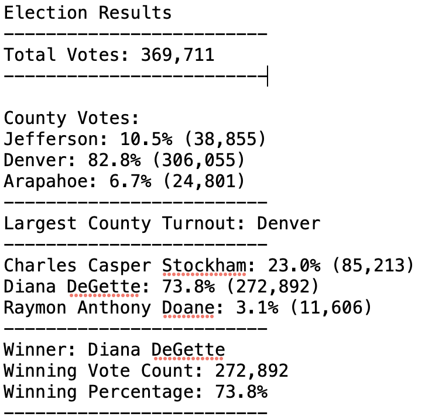

# Analysis of the Election Audit 

## Overview of the Election Audit 

In this election audit, we are helping Tom, a Colorado Board of Elections employee audit a recent US congressional election in Colorado.  We were tasked with reporting the total number of votes cast, total number of votes for each candidate, the percentage of votes for each candidate, and the winner of the election based on popular vote. 

***Purpose:*** After completing these tasks using Python software and coding scripts, we were then asked to help the election committee to complete an audit for: 

- the voter turnout for each county
- the percentage of votes from each county out of the total count
- the county with the highest turnout 

## Process for Obtaining our Results 

Instead of using Excel, we are writing code in Python to automate our results for future congressional districts. The plan is to: 

1. Calculate the total number of votes cast.
2. Find the voter turnout for each county
3. Calculate the percentage of votes from each county 
4. Determine the largest county turnout 
5. Get a complete list of candidates who received votes.
6. Calculate the percentage of votes each candidate received.
7. Calculate the percentage of votes each candidate won. 
8. Determine the winner of the election based on popular vote.


## Resources 
- Data Source: election_results.csv
- Software: Python 3.9.12, Visual Studio Code 1.71.1

## Election Audit Results  

The analysis of the election show that: 

- There were a total of 369,711 votes cast in the election.
- The voter turnout for each county:
    - Jefferson had 10.5% of the votes and a total of 38,855 votes.
    - Denver had 82.8% of the votes and a total of 306,055 votes.
    - Arapahoe had 6.7% of the votes and 24,801 votes. 
- The county with the highest turnout was Denver. 
- The candidates were: 
    - Charles Casper Stockham
    - Diana DeGette
    - Raymon Anthony Doane
- The candidate results were: 
    - Charles Casper Stockham received 23% of the vote and 85,213 votes.
    - Diana DeGette received 73.8% of the vote and 272,892 votes.
    - Raymon Anthony Doane received 3.1% of the vote and 11,606 votes.
- The winner of the election was: 
    - Candidate Diana DeGette, who received 73.8% of the vote and 272,892 number of votes. 


After looking through 369,711 total votes, Colorado's county ***Denver*** had the highest voter turnout (82.8% of the votes). Out of the three candidates (Charles Casper Stockham, Diana DeGette, and Raymon Anthony Doane), the winner by popular vote was: Candidate ***Diana DeGette*** who received 73.8% of the vote and 272,892 number of votes. 
    
    
## Election Audit Summary 
Although the election audit was done for Colorado, our code written for Python would work for any election audit.

For example, you can change the csv file that is being read at the beginning of the script. Instead of "election_results.csv" any election commision could change the file that contains their state's data: 
```
# Add our dependencies.
import csv
import os

# Add a variable to load a file from a path.
file_to_load = os.path.join("Resources", "election_results.csv")
# Add a variable to save the file to a path.
file_to_save = os.path.join("analysis", "election_results.txt")
```

Within their personal csv file that is being read, they may also need to change the index numbers in each row of the data (CVS file) that represent the candidate's name and/ county. For example, if the candidate's name is the first index (1st column on csv file), the index number would now be [0]. Instead of "candidate_name = row[2]", we would now write "candidate_name = row[1]" to retrieve the right information. 
```
# For each row in the CSV file.
    for row in reader:

        # Add to the total vote count
        total_votes = total_votes + 1

        # Get the candidate name from each row.
        candidate_name = row[2]

        # 3: Extract the county name from each row.
        county_name = row[1]
```
Lastly, the most convenient part of using this Python script for election audits is that the election's final results will be saved and printed to a txt file like the one below. If a different district's cvs election results file is uploaded as the new "file to read", we will see different names for the countys, candidates and their respective data and statistics.  


